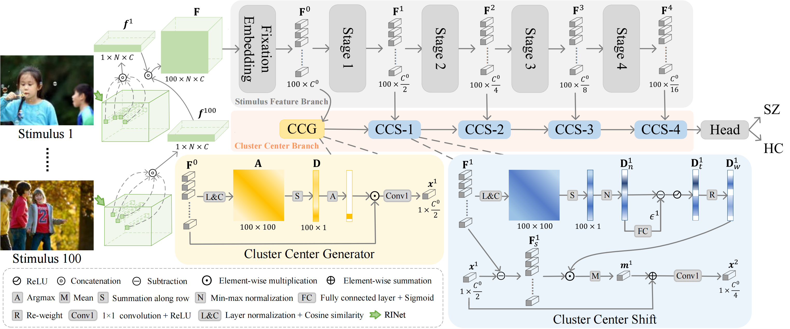

# EMS
This project provides the EMS dataset, the benchmark results, and the code of MSNet for **'EMS: A Large-Scale Eye Movement Dataset, Benchmark, and New Model for Schizophrenia Recognition'**, IEEE TNNLS 2024. [Paper link](https://ieeexplore.ieee.org/document/10645682).

- [Abstract](#abstract)
- [Dataset: EMS](#dataset-ems)
- [Benchmark](#benchmark)
- [Model: MSNet](#model-msnet)
  - [Model Architecture](#model-architecture)
  - [Requirements](#requirements)
  - [Training](#training)
  - [Validation](#validation)
  - [Testing](#testing)
- [Citation](#citation)
- [Acknowledgments](#acknowledgments)

## Abstract
Schizophrenia (SZ) is a common and disabling mental illness, and most patients encounter cognitive deficits. The eye-tracking technology has been increasingly used to characterize cognitive deficits for its reasonable time and economic costs. However, there is no large-scale and publicly available eye movement dataset and benchmark for SZ recognition. To address these issues, we release a large-scale Eye Movement dataset for SZ recognition (EMS), which consists of eye movement data from 104 schizophrenics and 104 healthy controls (HCs) based on the free-viewing paradigm with 100 stimuli. We also conduct the first comprehensive benchmark, which has been absent for a long time in this field, to compare the related 13 psychosis recognition methods using six metrics. Besides, we propose a novel mean-shift-based network (MSNet) for eye movement-based SZ recognition, which elaborately combines the mean shift algorithm with convolution to extract the cluster center as the subject feature, In MSNet, first, a stimulus feature branch (SFB) is adopted to enhance each stimulus feature with similar information from all stimulus features, and then, the cluster center branch (CCB) is utilized to generate the cluster center as subject feature and update it by the mean shift vector. The performance of our MSNet is superior to prior contenders, thus, it can act as a powerful baseline to advance subsequent study. 

## Dataset: EMS
We build the Eye Movement dataset for SZ recognition (EMS), which consists of eye movement data from 104 schizophrenics and 104 healthy controls based on the free-viewing paradigm with 100 stimuli. The following table provides an example for a quick overview of the EMS dataset. [Dataset link](https://pan.baidu.com/s/1AJxIUPlDPLzcNl90ZCoTBA) (password:`emss`).
| Index of Fix. | Duration (ms) | X (pixel) | Y (pixel) | Pupil |
| :-----------: | :-----------: | :-------: | :-------: | :---: |
|       1       |      205      |   518.5   |   371.3   | 1177  |
|       2       |      90       |   275.1   |   282.2   | 1262  |
|       3       |      305      |   600.3   |   271.1   | 1265  |
|       4       |      269      |   635.2   |   269.2   | 1326  |
|       5       |      318      |   597.3   |    266    | 1366  |
|       6       |      585      |   575.4   |   269.3   | 1442  |

## Benchmark
We retained the eye movement data of 48 subjects as the test set and the remaining 160 subjects were used for 4-fold cross-validation. For robust assessment, the average metrics of 4-fold cross-validation are regarded as the performance of validation and the model with the highest AUC will be tested on the test set.

 If you want to test your model on the test set of EMS, follow these steps:
 1. Download EMS dataset
 2. Run your model to compute predictions for the test set and save the predictions as [prob_test.txt](./prob_test.txt)
   (Each row of prob_test.txt: subject id, probability, probability after binarization)
 3. Email your .txt file to songyingjie_shu@163.com
 4. if you want to submit your model to this benchmark, please mention "I want to submit metrics of the model to the benchmark" in the email. The averaged metrics on the validation set, the .txt file for the test set and the name of your model are also needed in the email. If you have a publication for your model, please mention it in the email so that we can link to your metrics in the benchmark. 

<table><thead>
  <tr>
    <th  rowspan="2">Models</th>
    <th  colspan="6">Validation Set</th>
    <th  colspan="6">Test Set</th>
  </tr>
  <tr>
    <th >Acc.</th>
    <th >Sen.</th>
    <th >Spe.</th>
    <th >AUC</th>
    <th >Pre.</th>
    <th >F1-score</th>
    <th >Acc.</th>
    <th >Sen.</th>
    <th >Spe.</th>
    <th >AUC</th>
    <th >Pre.</th>
    <th >F1-score</th>
  </tr></thead>
<tbody>
  <tr>
    <td > <a href="https://www.sciencedirect.com/science/article/pii/S0165032722003251" >EDB_SVM</a></td>
    <td >0.7313 </td>
    <td >0.7156 </td>
    <td >0.7396 </td>
    <td >0.8086 </td>
    <td >0.7240 </td>
    <td >0.7195 </td>
    <td >0.6875 </td>
    <td >0.6667 </td>
    <td >0.7083 </td>
    <td >0.7813 </td>
    <td >0.6957 </td>
    <td >0.6809 </td>
  </tr>
  <tr>
    <td ><a href="https://www.sciencedirect.com/science/article/pii/S0165032722003251" >EDB_QDA</a></td>
    <td >0.7063 </td>
    <td >0.6026 </td>
    <td >0.7993 </td>
    <td >0.7205 </td>
    <td >0.7403 </td>
    <td >0.6638 </td>
    <td >0.7500 </td>
    <td >0.6667 </td>
    <td >0.8333 </td>
    <td >0.8073 </td>
    <td >0.8000 </td>
    <td >0.7273 </td>
  </tr>
  <tr>
    <td ><a href="https://www.sciencedirect.com/science/article/pii/S0165032722003251" >EDB_BYS</a></td>
    <td >0.7000 </td>
    <td >0.6065 </td>
    <td >0.7785 </td>
    <td >0.7987 </td>
    <td >0.7061 </td>
    <td >0.6510 </td>
    <td >0.7292 </td>
    <td >0.5833 </td>
    <td ><font color="#FF0000"><b>0.8750</b></font> </td>
    <td >0.7413 </td>
    <td ><font color="#FF0000"><b>0.8235</b></font> </td>
    <td >0.6829 </td>
  </tr>
  <tr>
    <td ><a href="https://www.sciencedirect.com/science/article/pii/S0167865520303536" >ESR_SVM</a></td>
    <td >0.7938 </td>
    <td >0.7946 </td>
    <td >0.7847 </td>
    <td >0.8498 </td>
    <td >0.7859 </td>
    <td >0.7889 </td>
    <td >0.7500 </td>
    <td >0.7083 </td>
    <td >0.7917 </td>
    <td >0.7760 </td>
    <td >0.7727 </td>
    <td >0.7391 </td>
  </tr>
  <tr>
    <td ><a href="https://www.sciencedirect.com/science/article/pii/S0167865520303536" >ESR_RF</a></td>
    <td >0.7625 </td>
    <td >0.7540 </td>
    <td >0.7639 </td>
    <td >0.8521 </td>
    <td >0.7549 </td>
    <td >0.7538 </td>
    <td >0.7292 </td>
    <td >0.7083 </td>
    <td >0.7500 </td>
    <td >0.7760 </td>
    <td >0.7391 </td>
    <td >0.7234 </td>
  </tr>
  <tr>
    <td ><a href="https://www.sciencedirect.com/science/article/pii/S0923596521000369" >IAS</a></td>
    <td >0.7563 </td>
    <td >0.7634 </td>
    <td >0.7500 </td>
    <td >0.8180 </td>
    <td >0.7770 </td>
    <td >0.7572 </td>
    <td >0.7500 </td>
    <td >0.6667 </td>
    <td >0.8333 </td>
    <td >0.8229 </td>
    <td >0.8000 </td>
    <td >0.7273 </td>
  </tr>
  <tr>
    <td ><a href="https://openaccess.thecvf.com/content_iccv_2017/html/Jiang_Learning_Visual_Attention_ICCV_2017_paper.html">LVA</a></td>
    <td >0.8188 </td>
    <td >0.7766 </td>
    <td >0.8585 </td>
    <td ><font color="#FF0000"><b>0.8987</b></font> </td>
    <td >0.8552 </td>
    <td >0.8096 </td>
    <td >0.7083 </td>
    <td >0.6667 </td>
    <td >0.7500 </td>
    <td >0.8038 </td>
    <td >0.7273 </td>
    <td >0.6957 </td>
  </tr>
  <tr>
    <td ><a href="https://ieeexplore.ieee.org/abstract/document/9506702">DDB_DoF</a></td>
    <td >0.7250 </td>
    <td >0.7872 </td>
    <td >0.6727 </td>
    <td >0.7645 </td>
    <td >0.7254 </td>
    <td >0.7446 </td>
    <td >0.6667 </td>
    <td ><font color="#FF0000"><b>0.8333</b></font>  </td>
    <td >0.5000 </td>
    <td >0.7483 </td>
    <td >0.6250 </td>
    <td >0.7143 </td>
  </tr>
  <tr>
    <td ><a href="https://ieeexplore.ieee.org/abstract/document/9506702">DDB</a></td>
    <td >0.7313 </td>
    <td >0.7866 </td>
    <td >0.6873 </td>
    <td >0.7772 </td>
    <td >0.7394 </td>
    <td >0.7512 </td>
    <td >0.7083 </td>
    <td >0.6667 </td>
    <td >0.7500 </td>
    <td >0.7882 </td>
    <td >0.7273 </td>
    <td >0.6957 </td>
  </tr>
  <tr>
    <td ><a href="https://ieeexplore.ieee.org/abstract/document/9956876">DVP</a></td>
    <td >0.7875 </td>
    <td >0.7548 </td>
    <td >0.8056 </td>
    <td >0.8516 </td>
    <td >0.8206 </td>
    <td >0.7769 </td>
    <td >0.7500 </td>
    <td >0.7083 </td>
    <td >0.7917 </td>
    <td >0.8194 </td>
    <td >0.7727 </td>
    <td >0.7391 </td>
  </tr>
  <tr>
    <td ><a href="https://ieeexplore.ieee.org/abstract/document/10419365">GPI_LSTM</a></td>
    <td >0.7125 </td>
    <td >0.6881 </td>
    <td >0.7424 </td>
    <td >0.7953 </td>
    <td >0.7291 </td>
    <td >0.6947 </td>
    <td >0.6875 </td>
    <td >0.7917 </td>
    <td >0.5833 </td>
    <td >0.7726 </td>
    <td >0.6552 </td>
    <td >0.7170 </td>
  </tr>
  <tr>
    <td ><a href="https://ieeexplore.ieee.org/abstract/document/10419365">GPI_GRU</a></td>
    <td >0.7063 </td>
    <td >0.7045 </td>
    <td >0.7188 </td>
    <td >0.7798 </td>
    <td >0.7219 </td>
    <td >0.6983 </td>
    <td >0.7500 </td>
    <td >0.7083 </td>
    <td >0.7917 </td>
    <td >0.8125 </td>
    <td >0.7727 </td>
    <td >0.7391 </td>
  </tr>
  <tr>
    <td ><a href="https://ieeexplore.ieee.org/document/10645682">MSNet</a></td>
    <td ><font color="#FF0000"><b>0.8313</b></font>  </td>
    <td ><font color="#FF0000"><b>0.8051</b></font>  </td>
    <td ><font color="#FF0000"><b>0.8708</b></font>  </td>
    <td >0.8972</td>
    <td ><font color="#FF0000"><b>0.8575</b></font>  </td>
    <td ><font color="#FF0000"><b>0.8244</b></font>  </td>
    <td ><font color="#FF0000"><b>0.8125</b></font>  </td>
    <td ><font color="#FF0000"><b>0.8333</b></font>  </td>
    <td >0.7917 </td>
    <td ><font color="#FF0000"><b>0.8854</b></font>  </td>
    <td >0.8000</td>
    <td ><font color="#FF0000"><b>0.8163</b></font>  </td>
  </tr>
</tbody></table>


## Model: MSNet

### Model Architecture
<p align="center">

</p>

### Requirements
Use docker from Docker Hub:
```commandline
$ docker pull pytorch/pytorch:1.10.0-cuda11.3-cudnn8-devel
$ docker run --gpus all --ipc=host -it -v path_of_MSNet:path_in_docker --name MSNet pytorch/pytorch:1.10.0-cuda11.3-cudnn8-devel bash 
```
or use docker from .tar file in this [link](https://pan.baidu.com/s/1imhjyRUVsQC08V1orr19Wg) (password:`emss`):

```commandline
$ docker load < MSNet.tar
$ docker tag IMAGE_ID msnet:v1.0
$ docker run --gpus all --ipc=host -it -v path_of_MSNet:path_in_docker --name MSNet msnet:v1.0 bash 
```

### Training
1. Clone this repository to "path_of_MSNet" and download the EMS dataset to "path_of_dataset". 
2. Download the .npy file (feature maps generated by RINet) from [link](https://pan.baidu.com/s/1NjAKLIWh3BDuIRAuoj-FXg) (password:`emss`) and put it to "path_of_MSNet" 
3. Download the weights of MSNet from [link](https://pan.baidu.com/s/1Zi5Gj3Ma5H0LqU0ohyOQqQ) (password:`emss`) and unzip it to "path_of_MSNet/result"
4. Run the following command to filter the fixations using 
```bash
$ python data_process/split_fix.py --dataset_dir path_of_dataset
```

Run the following command to train 

```bash
$ python train.py --dataset_dir path_of_dataset -set_name Set_1
```

### Validation 
Run the following command for each validation set 

```bash
$ python val.py --dataset_dir path_of_dataset -set_name Set_1
```

Run the following command to compute the threshold for each validation set

```bash
$ python data_process/metrics_ostu.py
```

Run the following command to compute metrics for each validation set and compute the average metrics of 4-fold cross-validation. 

```bash
$ python data_process/metrics_val.py
```

### Testing
 run the code using 
```bash
$ python test.py --dataset_dir path_of_dataset -set_name Set_1
```

## Citation
        @ARTICLE{10645682,
                author={Song, Yingjie and Liu, Zhi and Li, Gongyang and Xie, Jiawei and Wu, Qiang and Zeng, Dan and Xu, Lihua and Zhang, Tianhong and Wang, Jijun},
                journal={IEEE Transactions on Neural Networks and Learning Systems}, 
                title={EMS: A Large-Scale Eye Movement Dataset, Benchmark, and New Model for Schizophrenia Recognition}, 
                year={2024},
                volume={},
                number={},
                pages={1-12},
                doi={10.1109/TNNLS.2024.3441928}}
## Acknowledgments
The authors would like to thank the participation of subjects and doctors at Shanghai Mental Health Center and the subjects and students at Shanghai University. 
